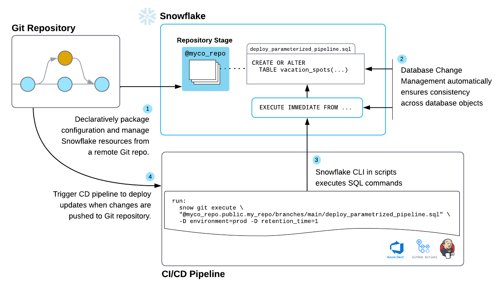
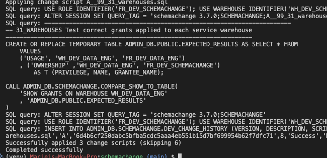
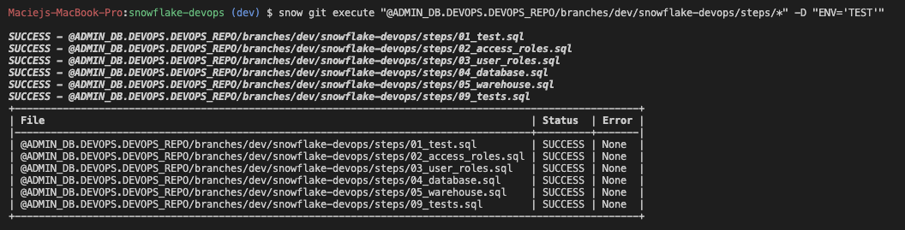

# schemachange-vs-snowflake-devops

Code repository containing samples for deploying Snowflake resources with schemachange and with Snowflake DevOps.
Accompanying blog post included below.

# Snowflake DevOps - first impressions and comparison with schemachange


## Snowflake resource lifecycle management tools

There are a number of options for programmatically managing the lifecycle of Snowflake resources. Terraform has previously been a popular choice - however due to many issues encountered - it is not recommended for teams without a wealth of Terraform and Infrastructure-as-Code (IaC) experience. As an alternative, we have been using schemachange - a tool following an imperative-style approach. It provides a low barrier of entry for teams used to SQL language while offering a good set of functionalites.

Despite the number of tools available, there is a gap in Snowflake’s native ability to provide object lifecycle management. Snowflake has been working on filling this gap and the recent introduction of [Snowflake DevOps may sufficiently fill that space](https://www.snowflake.com/en/blog/devops-snowflake-accelerating-development-productivity/). The goal of this post is to evaluate whether Snowflake DevOps is ready to replace schemachange as an object management tool.

## Our requirements

There are a number of things we want to be able to achieve with the tool of choice
- Snowflake securable objects such as roles, users, warehouses, databases and tables should be defined in code
- It should be possible to deploy these using CI/CD tools (automated deployment)
- It should be possible to deploy to multiple environments in Snowflake (either logical or physical separation)
- Ideally some testing should be possible - e.g. test that expected objects were created or that no additional objects of specific type exist in the environment

Next, we’ll introduce a sample deployment to Snowflake using both schemachange and Snowflake DevOps and evaluate both based on a number of criteria.

All the code used in this post, including the steps to set up both solutions, can be found in [our Git repository](https://github.com/maciejtarsa/schemachange-vs-snowflake-devops).

## schemachange

Schemachange follows an imperative style approach - meaning that Snowflake resources need to be explicitly defined and removed - e.g. just removing them from the code base won’t remove them from the Snowflake environment - schemachange does not maintain the state of what exists in your account.

The tool requires some initial setup in order to be able to run the deployment. You are most likely to perform this initial setup in the UI in a Snowflake workbook - but is it useful to save it to a git repository anyway to keep information about what has been deployed. This includes:
- A user for schemachange to authenticate with
- A role for that user to assume
- A database, schema and table for storage of change history table
- A warehouse used for executing scripts

Note that schemachange can use existing resources for the above - with the exception of the change history table - but that table can be created in an existing database and schema as well.

There are 3 types of schemachange scripts:
- Versioned, e.g. `V1.1__name.sql` - applied only once
- Repeatable, e.g. `R__name.sql` - applied at each run but only if contents of the file have changed - a hash of the contents of the file is kept in the history table
- Always, e.g. `A__name.sql` - applied at every run

They will be applied in that order - versioned first, then repeatable and always at the end.

As an imperative tool - it is designed to mostly work with versioned files, however in order to use pseudo-declarative style - we opted to define most of our resources using Repeatable scripts with the following constructs:
```sql
CREATE WAREHOUSE IF NOT EXISTS WH_{{ ENV }}_DATA_ENG
WITH INITIALLY_SUSPENDED = TRUE;
USE WAREHOUSE WH_{{ ENV }}_SCHEMACHANGE;

ALTER WAREHOUSE WH_{{ ENV }}_DATA_ENG
SET WAREHOUSE_SIZE = XSMALL
AUTO_SUSPEND = 60;
```
That way we first create a warehouse only if it doesn’t exist already and specify only the minimum parameters required. Then alter it to provide the parameters we expect to change in the future. If that resource needs changing later (e.g. size of a warehouse) - we just change the alter script - as it’s a repeatable file it will get applied at the next deployment. If we used `CREATE OR REPLACE`, any existing grants (or data if it’s a database, schema, etc.) would be lost.

We also found uses for the other types of scripts:
- Always scripts for running tests - we want the tests to run after each deployment run and as the last step -  to confirm we have the resources we expect
- Versioned scripts for removal of resources - as a one off action these are perfect for dropping existing resources and having that history recorded  

  
*Figure 1: Sample deployment of schemachange - 3 scripts were applied - our Always scripts - and 6 were skipped - Versioned and Repeatable*

To learn more about schemachange, [their GitHub page is a great start](https://github.com/Snowflake-Labs/schemachange).

## Snowflake DevOps

Snowflake recently released a set of tools under the umbrella ‘Snowflake DevOps’. The aim is to provide a powerful way to maintain a single source of truth with the use of a declarative approach to object management and automation of CI/CD workflows. The key to this is the new Git integration which can be used to securely connect your git repository to a Snowflake Notebook or to SQL or Python files. Snowflake updated their CLI tooling and introduced Snowflake CLI which is a key element of this integration.

The other key building blocks are:
- the new `CREATE OR ALTER` statement which combines `CREATE OR REPLACE` with `ALTER` and is now compatible with most Snowflake objects
- `EXECUTE IMMEDIATE FROM` command which allows you to execute SQL from a Git repository in Snowflake

The initial setup is quite similar to schemachange - you’ll need a user, role, database and schema. You won’t need a table to store the history of scripts run, but you will need an api integration for your git repository instead. Again - you could use existing resources and define your git integration in one of the existing schemas if you choose to.

Snowflake Devops is declarative - allowing for your resources definition to be concise, idempotent and easy to understand. However, we had high hopes for Snowflake managing the state of objects - this is not currently the case - but more on that later.

Your SQL scripts will generally be very similar to schemachange, e.g. the warehouse declared earlier would be equivalent to:
```sql
CREATE OR ALTER WAREHOUSE WH_{{ ENV }}_DATA_ENG
WITH INITIALLY_SUSPENDED = TRUE
WAREHOUSE_SIZE = XSMALL
AUTO_SUSPEND = 60;
```
The seamless integration between Python and SQL is an advantage - you can have your definition in SQL or Python and switch as needed. You can specify which scripts to run by pattern matching, you can also pass parameters for your Jinja scripts. Unfortunately, it looks like all scripts will always be run - so unless you want to work with some complicated conditions - or develop a setup similar to [SlimCI](https://medium.com/@thiernomadiariou/slim-ci-with-dbt-core-and-snowpark-ffbb80b81fec) - you will likely end up with execution of a lot of files in each deployment.

  
*Figure 2: Sample deployment with Snowflake DevOps - 6 scripts were successfully executed*

To learn more about Snowflake DevOps, check out [Snowflake documentation](https://docs.snowflake.com/en/developer-guide/builders/devops) or their [QuickStart Guide](https://quickstarts.snowflake.com/guide/getting_started_with_snowflake_devops/#0).

## Evaluation
Having performed a minimal setup of Snowflake infrastructure using both tools, we can now evaluate if Snowflake DevOps is mature enough to replace schemachange.

### Initial setup
Initial setup is very similar - both tools need a user, role, database, schema and warehouse. Schemachange also needs a table to store the history of deployments (1 per environment), while DevOps needs a git integration to connect to the repository where the code is stored. One potential issue with schemachange’s table is that it could become quite big fairly quickly - as many deployments are run, the number of records could grow quite quickly - that table may eventually need some optimisation.

### Maintaining state
Schemachange is stateless - therefore it doesn’t maintain the state - the user needs to manage this. However, it does allow for skipping files with no changes made (with use of Repeatable files). This can be very useful if only small changes are made - a bit like Terraform only amending resources which are altered. Snowflake DevOps doesn’t maintain the state either and as far as we could find, there was no easy way to only run scripts for changed resources. There might be a way to create a SlimCI-like set-up - but that would create additional overhead.

### Removal of resources
Being an imperative tool - any removals of resources have to be explicit in schemachange - you need to include a `DROP` statement. In the past, we used versioned files for this purpose, which worked quite well. Snowflake DevOps is a declarative tool - however as it does not maintain the state - removal has to be explicit as well. Unfortunately - there is no facility to run that operation once only as part of the deployment. You will either end up re-running `DROP IF EXISTS` on every deployment, drop resources outside of version control (please don’t), or have a separate set of deployment scripts for dropping resources. None of these are good options.

### Bringing in existing resources
In both tools, you can bring existing resources into source control (add definitions for resources created previously into your code base). This will require transferral of ownership to the role deploying the tool - in order to `CREATE OR ALTER` a resource, the role performing this action needs to own the resource.

### Separation of environments
You can use Jinja syntax in both tools - this allows for easy replacement of values in your scripts and you can call it in your pipelines by passing variables - e.g. have a deployment to Development and another to Production using the same scripts. You can also use Jinja to use conditional statements in both tools - e.g. only deploy a resource in a specific environment.

### Testing
Neither tool has any native setup for testing. The proposed solution is to have multiple environments and if something fails to create in a lower environment - your deployment pipeline will prevent any changes to higher environments. Additionally with schemachange, we created a stored procedure which takes a temporary table containing expected results and a statement like `SHOW DATABASES` as arguments and compares the results of that statement to contents of the temporary table. The same setup can be achieved with Snowflake DevOps.

## Takeaways

Overall - we think that Snowflake DevOps is mature enough to provide programmatic resource lifecycle management in Snowflake. As a fairly new tool - it is still missing some of the functionality we would have liked to see - e.g. a way to only run changed resources. However Snowflake is likely to be adding a lot of further developments into this area - it’s a space worth watching. 

Having said that - if schemachange works well for you - keep using it. It is still a very mature tool with a lot of features and flexibility. There’s also nothing stopping you from using `CREATE OR ALTER` statements in schemachange as well!

If you want to chat about or get help with implementing Snowflake for your data stack, please [reach out](https://www.mechanicalrock.io/lets-get-started)!

> Header image from [Snowflake](https://docs.snowflake.com/en/developer-guide/builders/devops)

#### Corrections
The initial version of this article included reference to `ACCOUNTADMIN` owning all the resources created by Snowflake DevOps. This is not the case and was a configuration error. The role deploying the resources is the owner.

## Licence
Copyright 2025 Mechanical Rock

Licensed under the Apache License, Version 2.0 (the "License");
you may not use this file except in compliance with the License.
You may obtain a copy of the License at

    http://www.apache.org/licenses/LICENSE-2.0

Unless required by applicable law or agreed to in writing, software
distributed under the License is distributed on an "AS IS" BASIS,
WITHOUT WARRANTIES OR CONDITIONS OF ANY KIND, either express or implied.
See the License for the specific language governing permissions and
limitations under the License.
